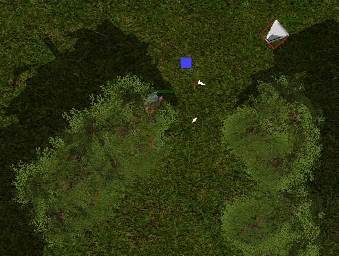

# PHASARV - WIP

This game project developed on the GO language. 

The game is a topdown dynamic battle.

## Code

Project code is in the vendor directory

## Engines

Opengl engine - [tbogdala/fizzle](https://github.com/tbogdala/fizzle)

2dPhys engine - chipmunk [TheZeroSlave/chipmunk](https://github.com/TheZeroSlave/chipmunk) forked from vova616/chipmunk

## TODO

- Models:
	- Airplanes
	- Trees
	- Environment objects

- Lightining:
	- Directional shadows
	- Blur shadows
	- [?] Ambient Occlusion

- Effects:
	- Explosions
	- Fog & clouds
	- [?] Water

- UI

- Map Editor

- Network